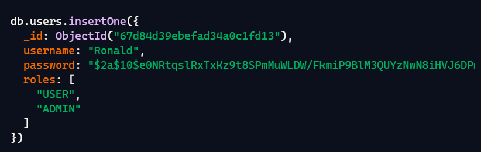
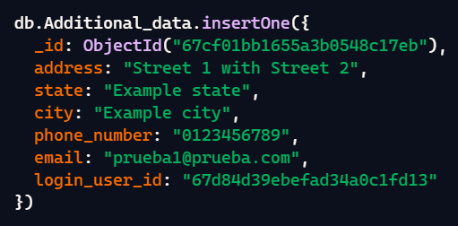
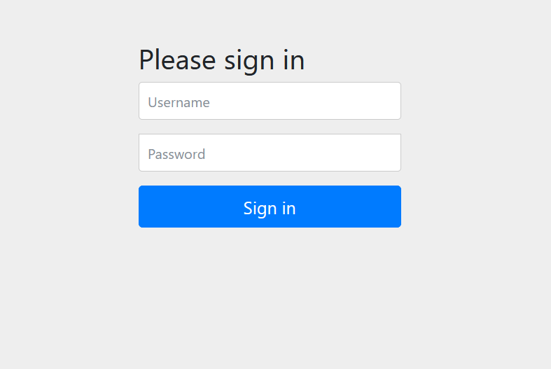

# spring-boot y spring-data with spring-security wearing mongodb
CRUD with Spring Boot - Spring Data - Spring Security basic - MongoDB

## Script users
- creating a collection users in MongoDB



## Script Additional-data
- creating a collection users in MongoDB



## Endpoint Api´s
- user registration: <br/>
POST http://localhost:8080/api/public/user/registration
<br/><br/>
BODY: 
``` Json
{
    "username": "Ronald2",
    "pwd": "12345678",
    "roles": ["ADMIN"]
}
```

- query of all users (Rol ADMIN): <br/>
GET http://localhost:8080/api/admin/all

- Option 1: Query user by id (Rol USER) using MongoRepository, union of the users and Additional_data collections: <br/>
GET http://localhost:8080/api/user/infoone/67cc84138f9fd492440ff1cc

- Option 2: Query user by id (Rol USER) using MongoTemplate union of the users and Additional_data collections: <br/>
GET http://localhost:8080/api/user/infotwo/67cc84138f9fd492440ff1cc

- Registration of additional data:
POST http://localhost:8080/api/user/additionaldata
<br/><br/>
BODY:
``` Json
{
    "address": "calle 67 con calle 34",
    "state": "Bogotá2",
    "city": "Bogotá2",
    "phone_number":"0123456789",
    "loginUserId":"67d2f2110bb88172a7aba223"
}
```
- Updating additional data:
PUT http://localhost:8080/api/user/update/additionaldate
<br/><br/>
BODY:
``` Json
{
    "id":"67cf76a8b6250f04bdba2c72",
    "address": "calle 51 con calle 8",
    "state": "Bogotá3",
    "city": "Bogotá3",
    "phone_number":"1123456789",
    "email": "ronald1@prueba.com",
    "loginUserId":"67d05ec46aa6c82e5398f1dc"
}
```
- Delete user by id:
DELETE http://localhost:8080/api/user/delete/67cf769db6250f04bdba2c71

## Spring Security
Endpoints protected with the USER / ADMIN roles request authentication (formLogin).


